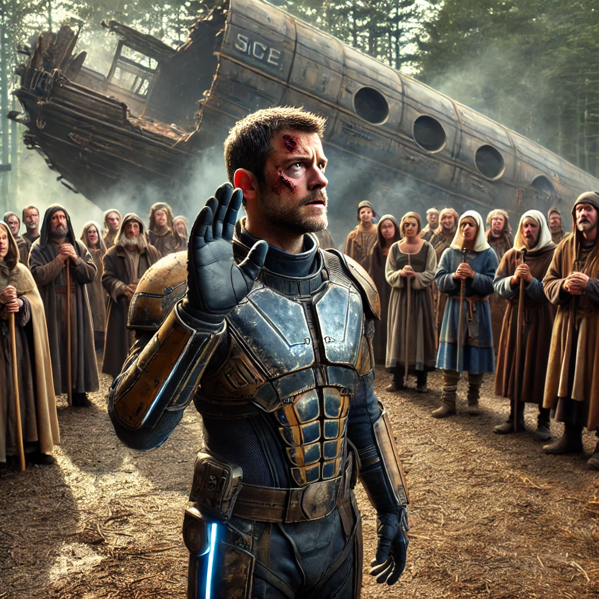

# Das Buch

Ich hatte eine fixe Idee und wollte mal testen, ob man ChatGPT auch als Ghostwriter für sich nutzen kann.
Eine schnelle Idee in die Prompt-Eingabe gehämmert und auf das Ergebnis gewartet.

## Die Eingabe
Schreib mir bitte ein Buch.
es soll um einen interstellaren Krieg gehen, in dem zwei Menschliche Parteien gegeneinander kämpfen.
Als Hauptprotagonist soll ein Soldat der Alianz genommen werden. Dieser dient auf einem Transportschiff für Kriegsgefangene.
Dieses Schiff stürzt auf einem Planeten ab, auf dem die Zivilisation im Mittelalter der Erde ist.
Die meisten sterben bei dem absturz oder werden sehr schwer verletzt.
Ein gefangener kann dabei entkommen und mischt sich unter die Bewohner des Planeten.
Der Soldat der Alianz ist mit der Situation überfordert und zeigt den Menschen seine Technik.
Diese verehren ihn als Magier und die neue Macht steigt dem Soldaten zu Kopf.
Er unterwirft den ganzen Kontinent und reißt die Macht an sich.
Der Gefangene lässt es nicht auf sich beruhen und gründet eine untergrund Gruppe, die gegen den "Magier" in den Krieg ziehen will.
Nach vielen gefährlichen Rückschlägen stirbt der gefangene und der Magier wiegt sich in Sicherheit.
Die Allianz kommt auf den Planeten, nimmt den Magier gefangen und verschwindet wieder.
Die Menschen bleiben auf sich alleine gestellt zurück.
Es entsteht ein Machtvakuum und ein Bürgerkrieg bricht aus um die Vorherschaft auf dem Kontinent.
Es gibt mehrere Gruppen, einige sind ebenfalls in der Lage die hightech Geräte des Magiers zu benutzen, andere nicht.
Somit gibt es mindestens 3 Parteien (Magier, Soldaten, Untergrundkämpfer)

## Entwurf von ChatGPT
Hier ist ein grober Entwurf für die Struktur und Kapitel eines Buchs mit deinem Konzept. Es hat das Potenzial für ein episches Science-Fiction/Fantasy-Abenteuer:

---

### **Titel: Sternenfeuer**

#### **Kapitel 1: Der Krieg der Sterne**
- **Einleitung:** Vorstellung der Galaktischen Allianz und des Konflikts mit einer Splitterfraktion der Menschheit, den sogenannten „Kolonisten“. Die Allianz kämpft, um die Menschheit zu vereinen, während die Kolonisten sich von zentraler Kontrolle lossagen und eigene Planeten beanspruchen.
- **Hauptfigur:** Der Protagonist, Soldat Kyle Novan, dient auf einem Transportschiff für Kriegsgefangene, das die Kolonisten-Soldaten zur Aburteilung in eine Raumstation bringen soll. Er ist erfahren, aber müde vom Krieg.

#### **Kapitel 2: Absturz auf Terra Primus**
- **Der Absturz:** Nach einem plötzlichen Angriff wird das Transportschiff beschädigt und stürzt auf einen unbekannten Planeten ab, den die Crew als Terra Primus tauft. Die meisten an Bord sterben oder sind schwer verletzt.
- **Überlebende:** Kyle überlebt den Absturz schwer verletzt und bemerkt schnell, dass die Technologie nicht mehr vollständig funktionsfähig ist. Er entdeckt, dass einer der gefangenen Kolonisten, Damon Crane, entkommen ist.

#### **Kapitel 3: Begegnung mit der Mittelalterlichen Welt**
- **Fremde Kultur:** Kyle entdeckt, dass der Planet bewohnt ist – die Zivilisation ist technisch auf einem mittelalterlichen Niveau, geprägt von Fürsten, Bauern und Magiern. Er wird schnell als „Magier“ verehrt, da die Menschen seine Technik und Waffen als Zauberei wahrnehmen.
- **Damon Crane:** Damon mischt sich unter die Einheimischen und beginnt, Gerüchte über den „bösen Magier aus den Sternen“ zu verbreiten.

#### **Kapitel 4: Aufstieg des Magiers**
- **Machtstreben:** Kyle, geblendet von der Bewunderung und dem Einfluss, nutzt seine Technik, um sich Respekt zu verschaffen und den Kontinent zu erobern. Er wird zu einem gefürchteten Herrscher, der seine Macht durch technische „Magie“ sichert.
- **Herrschaft über den Kontinent:** Kyle etabliert ein strenges Regime, sammelt eine Armee und unterwirft die Menschen mit Waffengewalt und Technik. Die Einheimischen verehren ihn als ihren „Sternenmagier“.

#### **Kapitel 5: Widerstand im Untergrund**
- **Damon Crane:** Damon gründet eine Widerstandsgruppe, um gegen Kyle zu kämpfen. Er nutzt alte Techniken und überliefertes Wissen der Kolonisten, um eine kleine Armee zu schulen und gegen den „Magier“ vorzugehen.
- **Kämpfe und Rückschläge:** Damons Gruppe wagt mehrere Aufstände, wird jedoch immer wieder niedergeschlagen. Kyle erkennt die Gefahr und verstärkt seine Position.

#### **Kapitel 6: Die letzte Schlacht**
- **Der finale Kampf:** Damon und seine Untergrundkämpfer bereiten einen letzten Angriff vor. In einem spektakulären Gefecht opfert Damon sich, um Kyles Herrschaft zu schwächen, doch sein Tod markiert das Ende des organisierten Widerstands. Kyle glaubt, er sei unantastbar.

#### **Kapitel 7: Die Rückkehr der Allianz**
- **Allianz-Intervention:** Unerwartet erreicht ein Aufklärungstrupp der Allianz den Planeten und entdeckt Kyles Herrschaft. Sie nehmen ihn gefangen, desillusioniert und als Verräter an die Prinzipien der Allianz. Die Allianz verlässt den Planeten, überlässt die Zivilisation ihrem Schicksal und zerstört Kyles Waffen und Technologie, um weitere Einmischung zu verhindern.

#### **Kapitel 8: Das Machtvakuum**
- **Folgen:** Ohne Kyles Einfluss bricht auf dem Kontinent ein Bürgerkrieg aus. Verschiedene Fraktionen versuchen, die Macht an sich zu reißen, während einige wenige von Kyles Geräten übriggeblieben sind und das Kräfteverhältnis stören.
- **Dauerhafter Konflikt:** Die Welt verändert sich grundlegend, der Kontinent versinkt in Chaos und Krieg, da niemand die Mittel oder das Wissen hat, den Frieden zu sichern.

#### **Epilog: Die Saat des Sternenfeuers**
- **Legacy:** Die Legenden von dem „Sternenmagier“ und seinem Widersacher Damon werden mündlich weitergegeben, und die Geschichte von Terra Primus geht als Warnung in die Geschichte der Menschheit ein. Der „Sternenmagier“ wird zum Mythos, ein Symbol für Macht und Verderbnis.

---

Diese Struktur kann durch ausführliche Charakterstudien, Intrigen und Wendungen ausgebaut werden.

## Das erste Kapitel
Auf Grundlage des groben entwurfs, habe ich ChatGPT gebeten das erste Kapitel zu schreiben.
Das kam dabei raus.

### Kapitel 1: Der Krieg der Sterne**

*Das Licht der nahen Sonne fiel durch das Cockpitfenster des Kriegsschiffes „Eos,“ benannt nach der Göttin der Morgenröte, die ein neues Zeitalter bringen sollte. Doch für Soldat Kyle Novan brachte dieser Sonnenaufgang keine Hoffnung. Er lehnte sich im Kommandosessel zurück, das Gesicht in tiefen Schatten gehüllt, während er auf die massive Panzertür starrte, die zum Laderaum führte. Dahinter lagen die Gefangenen, regungslos und stumm, wie schlafende Tiere. Die „Kolonisten“, wie man sie nannte, waren eine Absplitterung der Menschheit, ein Albtraum für die Galaktische Allianz. Und für Kyle – eine Erinnerung an alles, was er verloren hatte.*

---

Der tiefe, gleichmäßige Atem der Eos erfüllte den Raum. Jedes Mal, wenn Kyle die Augen schloss, hörte er die feine, dröhnende Vibration, das rhythmische Rauschen der Energiegeneratoren, die das gesamte Schiff versorgten. Doch diesmal hielt ihn ein Gedanke wach, der wie ein Splitter in seinem Kopf steckte: *Was passiert nach dem Krieg?*
Er wollte nicht an die Antworten denken. Kyles Leben war seit Jahren vom Kampf geprägt, von der Ungewissheit eines nächsten Einsatzes, und doch fühlte er eine unbestimmte Angst vor dem, was kommen könnte, wenn alles vorbei war.
Eine schrille Warnsirene riss ihn aus seinen Gedanken. Auf den Anzeigen blitzten rote Lichter, die durch das Cockpit tanzten. Kyle riss den Kopf herum und sah auf das Leuchten der Bildschirme. 
„Feindlicher Beschuss erkannt“, meldete die Computerstimme monoton. „Empfangene Treffer: 2. Abschusswahrscheinlichkeit: hoch.“
Kyle sprang aus dem Sitz und griff nach den Steuerkontrollen. Neben ihm tauchte Hauptmann Riva auf, sein Vorgesetzter, das Gesicht gezeichnet von Narben und finsterem Entschluss.
„Es ist ein Hinterhalt, Novan!“ Riva schrie gegen das Heulen der Sirenen an. „Die Kolonisten haben Verstärkung geschickt. Wir sind umzingelt!“
Kyle fühlte, wie das Adrenalin durch seine Adern schoss. Instinktiv griff er die Steuerung, lenkte das Schiff in eine Kurve, doch er spürte bereits die Wucht eines weiteren Treffers. Die Struktur des Schiffs vibrierte unter ihm, als würde es auseinanderbrechen. 
„Hauptsysteme ausgefallen“, tönte die Computerstimme erneut. „Notlandemodus wird eingeleitet.“
„Notlandung? Wo?“, schrie Riva.
„Ein planetarer Körper in unmittelbarer Nähe“, antwortete der Computer. „Name unbekannt. Atmosphäre atembar. Beschaffenheit: bergig, bewaldet. Zivilisationsstatus: primitiv.“

---

Die Eos verlor rapide an Höhe und wurde von der Schwerkraft des Planeten erfasst. Kyle fühlte, wie sich sein Magen zusammenkrampfte, während das Schiff unkontrolliert auf den unbekannten Planeten zuraste. Funken sprühten aus den Bedienpulten, Kabel brannten, Rauch erfüllte das Cockpit.
„Alle Truppen in den Notfallmodus! Bereiten Sie sich auf den Aufprall vor!“ Riva schrie, doch seine Stimme wurde von dem Getöse des Sturzes verschluckt.
Kyle sah auf die Instrumente. Der Boden kam näher, rasend schnell. Der Aufprall war unvermeidlich.
Er griff den Stuhl mit beiden Händen und hielt sich fest. Sein Herz raste, und die Sekunden zogen sich endlos hin, während das Bild des Planeten auf dem Bildschirm in seine Gedanken brannte: grüne Wälder, blaue Flüsse, ein Paradies in einer brutalen Galaxis. 
Dann der Aufprall.
Der Lärm war ohrenbetäubend, als die Eos in den Boden rammte. Metall krümmte sich, das Licht der Notbeleuchtung flackerte und erlosch. Kyle wurde nach vorn geschleudert, sein Körper schlug hart gegen die Steuerkonsole. Dunkelheit umfing ihn, und alles wurde still.

---

**Später…**

Kyle kam langsam zu sich. Ein dumpfes Dröhnen erfüllte seinen Kopf, und ein stechender Schmerz durchzuckte seine Rippen. Blut tropfte von einer Wunde an seiner Stirn und lief ihm über das Gesicht. Er blinzelte, bis seine Augen sich an die Dunkelheit gewöhnt hatten. Der Rest des Cockpits lag in Trümmern, zerschlagen und zerstört. 
Er hörte ein leises Stöhnen und drehte sich um. Hauptmann Riva lag bewegungslos, das Gesicht bleich, sein Atem schwach. Kyle kroch zu ihm hinüber, seine eigenen Schmerzen ignorierend, und überprüfte den Puls des Hauptmanns. Nichts.
Er senkte den Kopf und ließ einen langen Atemzug entweichen. Die Eos – seine Mannschaft – seine Kameraden – sie waren alle verloren. Ein Gefühl tiefer Verzweiflung überkam ihn, doch dann riss ein Geräusch ihn aus seiner Betäubung.
Es kam von draußen, vor der zerschmetterten Hülle des Schiffes. Stimmen. Sie klangen rau und ungewohnt, eine Sprache, die er nicht verstand. Kyle richtete sich auf und spähte durch das zerbrochene Fenster. Dunkle Gestalten bewegten sich zwischen den rauchenden Trümmern der Eos. Sie trugen grobe Gewänder, Rüstungen aus Leder und Metall, und hielten primitive Waffen in den Händen – Speere, Schwerter und Schilde.
Kyle konnte kaum glauben, was er sah. Es waren Menschen – oder menschenähnliche Wesen –, doch sie lebten in einer Gesellschaft, die den Anschein hatte, aus einer längst vergangenen Zeit zu stammen. 
„Der Sternenkrieger ist abgestürzt!“ rief einer der Männer in einer tiefen, donnernden Stimme. „Ein Omen der Götter! Ein Zeichen!“
Kyle schluckte schwer, die Realität der Situation sank langsam in sein Bewusstsein. *Ein Omen der Götter.* Die Fremden hatten ihn und sein Schiff für etwas Göttliches gehalten.
Mit einem letzten Blick auf die toten und verletzten Kameraden im Inneren der Eos atmete Kyle tief durch und hob die Hand. Seine Augen trafen die des Anführers der Gruppe, eines älteren Mannes mit langem grauem Haar und einer verzweifelt ehrfürchtigen Miene.
Und in diesem Augenblick wusste Kyle, dass er seine einzige Überlebenschance nutzen musste.
„Ich bin... euer Magier“, flüsterte er, die Worte schwer und fremd auf seiner Zunge. Die Gruppe starrte ihn mit geweiteten Augen an, ein Raunen ging durch die Menge.
Ein Gedanke formte sich in seinem Kopf: *Vielleicht kann ich diese Welt doch noch überleben.*

# Fazit
Man kann sich auf jeden Fall inspirieren lassen und seine Geschichte mit großer Unterstützung zu 'Papier' bringen.
Das ganze hat mich ca. 20 Minuten gekostet und es wäre binnen kürzester Zeit eine nette Kurzgeschichte.
Mit ein paar gezielten Eingaben, kann ChatGPT auch nette Grafiken erstellen, die man mit in das Buch einbringen kann.
