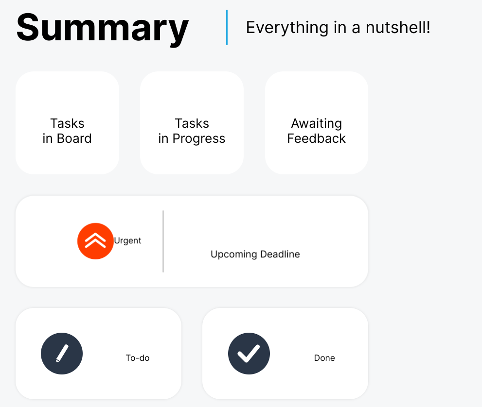
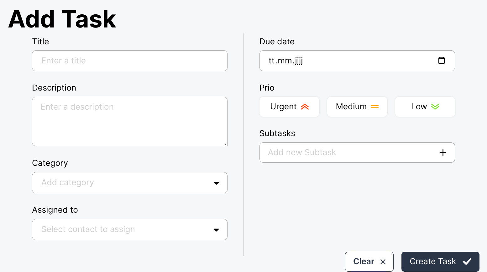

# Vorsätze für 2025

Die letzten Jahre hatte ich mir immer keine Vorsätze fürs Jahr gemacht.
In den letzten Wochen hatte ich mich mit Notizbüchern auseinander
gesetzt und mit _Bulletjurnaling_ und anderen Methoden.

Dabei kam immer wieder auf, dass man sich große Ziele für lange
Zeiträume setzten soll. Damit diese aber **schaffbar** werden,
soll man sich _Meilensteine_ oder _Zwischenziele_ setzten.

Also den großen Brocken in kleinere Happen zerlegen.

Da gibt es nun unterschiedliche Ansätze:

- Quartalsziele
- Monatsziele
- Wochenziele

Also für nächstes Jahr sehe ich dann zwei große _Brecher_ für mich:

1. Auswanderung nach Schweden
1. Ich will immer noch Programmierer werden

## Auswandern nach Schweden

Die erste Aufgabe kann ich zum jetzigen Zeitpunkt nicht sinnvoll
in kleine Aufgaben zerlegen. Bevor es da überhaupt irgend etwas zu
planen gibt, müssen wir erstmal sehen, wie es mit dem Haus
weiter geht. Der Verkauf zieht sich. Wahrscheinlich auch, weil
gerade Weihnachtszeit ist und alles irgendwie im _Schlafmodus_ ist.

## Programmierer werden

Diese Aufgabe schleppe ich nun schon geraume Zeit mit mir herum.
So ganz hat mich das auch nie losgelassen. Zum Auswandern passt
der Job _eigentlich_ auch ganz gut, da man quasi von überall
aus arbeiten kann. Solange man eine Internetverbindung bekommt,
um den Quellcode hoch- und runterladen zu können.

### Zerlegung der Aufgabe

Ein paar Aufgaben warten da schon in der Warteschleife auf Abarbeitung:

1. Portfolio erneuern
1. Join neu schreiben
1. Kundenprojekt online bringen
1. Bewerungen schreiben

#### Portfolio

Das wäre wohl die erste Aufgabe, die ich als dringenstes
abarbeiten müsste.

Ich bin da auch schon dran.

Das alte [Portfolio](https://kay-beckmann.com) hatte ich in
Angular entwickelt, wärend der Schulung bei der
[Developer Akademie](https://developerakademie.com/).
Dieses Portfolio portiere ich aktuell in ein VUE Projekt.
Dabei erstelle ich das Portfolio gleich multilingual in den Sprachen

- Deutsch
- Englisch
- Schwedisch

Deutsch ist halt meine Muttersprache und noch versuche ich am deutschen
Markt Fuß zu fassen. Englisch ist die Sprache in der IT-Techwelt
(sofern man auf die Profis der _DA_ hören kann) und Schwedisch wird
dann wahrscheinlich bald die Sprache meiner Wahl werden.
Wenn ich in der neuen Wahlheimat als Programmierer einen Job
bekommen möchte, muss ich auch die Landessprache bedienen.

Bei der Übersetzung hilft mir aber noch ChatGPT.

#### Join

Join habe ich in der Zeit bei der _DA_ schon geschrieben.
Damals war es ein Gruppenprojekt und wurde mit HTML, CSS und
JavaScript geschrieben, ohne irgendein Framework.

Die neue Version soll in VUE geschrieben werden.
Zusätzlich schreibe ich ein Backend in Django, damit die
**CURS-Fehler** nicht wieder auftreten. Diese kamen in der ersten
Version, da es kein echtes Backend gab und die Daten per Umwege
vorgehalten wurden.

Nach dem Login soll erstmal die oben dargestellte Übersicht erscheinen.
Hier erhält der Benutzer die wichtigsten Informationen in einer
Zusammenfassung.

Um eine neue Aufgabe anzulegen, gibt es die Eingabemaske 'Add Task'.
Diese wird später auch verwendet, um eine Aufgabe zu bearbeiten.

Die erfassten Daten werden dann mit dem Backend syncronisiert und dort
in einer Datenbank gespeichert.

Dieses Projekt werde ich nach dem Portfolio fertig stellen.
Join soll zwar als Projekt mit ins Portfolio, aber die Verlinkung im
Portfolio ist dann ein leichtes und kann zu einem späteren Zeitpunkt
nachgereicht werden.

Ich bin mir noch nicht sicher, ob ich Join als mehrsprachige Version
erstellen werde.

#### Kundenprojekt

Ich habe ein erstes Kundenprojekt, dass im Januar online gehen soll.
Dies hat natürlich oberste Priorität.

Mit dem ersten Kunden und dem damit verbundenen Projekt würden
regelmäßige Zahlungen eingehen.

Nachdem wir in modernen Zeiten leben, werden Webseiten auch nicht
einfach nur noch erstellt und verkauft.

Dem Kunden wird ein Rundum-Sorglos-Paket verkauft. Dieses beinhaltet:

- die Webseiten erstellung (samt Impressum, DSGVO, etc.),
- Das Hosting mit entsprechender Infrastruktur
- Die Pflege und Wartung (Auch Anpassung nach gesetzlichen Änderungen)
- Änderungen wenn sich beim Kunden etwas ändert

Somit kann man Kunden langfristig an sich binden und hat steten
Geldeingang, statt einmalig eine "hohe" Auslöse und danach muss man
wieder Kunden suchen gehen. Das macht den ganzen Bereich deutlich
planbarer und konstanter.

#### Bewerbungen

Die Bewerbungen müssen bis zum Schluss warten.

Wahrscheinlich wird das auch erst in der neuen Wahlheimat dann
konkretisiert.

### Zeitplanung

Zerlegen wir das ganze obrige Gebilde nun in einen Zeitstrahl.

#### Januar

Kunde drängeln, damit ich die fehlenden Unterlagen bekomme!
Die Seite soll bis **spätestens** ende Januar online sein.

#### Febraur

Bis Ende Februar will ich mein Portfolio wieder hübsch haben.

#### März

Bis Ende März will ich Join soweit haben, dass es grundsätzlich
lauffähig ist. Weitere Feinschliffe können dann noch folgen.

# Schlußwort

Das wäre so _GAAAANZ_ grob geplant mein erstes Quartal.

**Zusätlicher Vorsatz:**

- Zum Monatswechsel einen Rückblick und einen Ausblick schreiben

Dieser Blog bietet sich nun dafür an, dass ich aller Hand schriftlich
festhalten kann und dies auch immer wieder nachlesen kann.

Somit kann ich zum Monatsende immer gut sehen, ob ich im Rahmen bin
oder nicht.
