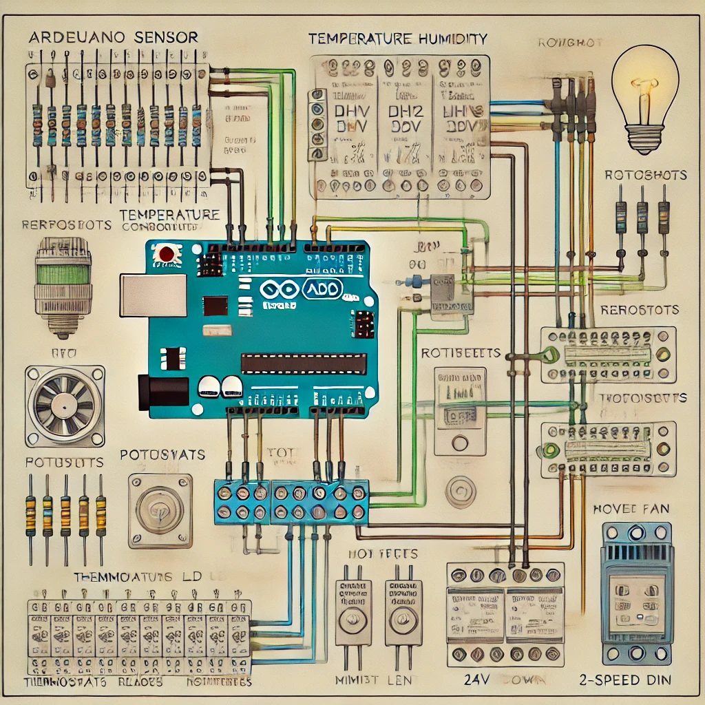

# Raumsteuerung

Erstmal möchte ich kurz erklären, was ich mir unter einer Raumsteuerung
vorstelle und warum ich die Idee in die Ideenschmiede eingebracht habe.

## Hintergrund

Ich habe eine technische Ausbildung, bin ein Spielkind und zu allem
Überfluss auch noch stinkend faul.
Das ist irgendwie eine gefährliche Kombination. Es hat zur Folge, dass ich
Dinge ungern mehrfach mache und sie nur erledige, wenn ich einen Sinn darin
sehe. Deshalb überlege ich mir Systeme, die wiederkehrende Aufgaben für
mich übernehmen.

In der Programmierung sind das dann Programme oder Skripte. In der realen
Welt helfen oft auch gekaufte Geräte wie Geschirrspüler oder Waschmaschinen.

## Ziel der Idee

In einem Raum gibt es zwar nicht allzu viel zu tun, aber auch hier sind es
immer wieder die gleichen wiederkehrenden Aufgaben:

1. Lüften
1. Heizung ein-/ausschalten
1. Licht ein-/ausschalten

Das sind Aufgaben, die sich hervorragend automatisieren lassen. Dafür eignet sich ein sogenannter Mikrocontroller besonders gut.
Den Unterschied zwischen einem Mikrocontroller und einem Computer erkläre ich im Folgenden.

### Computer

**Meine** Definition eines Computers im weitesten Sinne ist ein Gerät, das ein Betriebssystem hat, welches die Hardware verwaltet. Dazu gehören:

- Speichergeräte
  - Festplatte
- Eingabegeräte
  - Maus
  - Tastatur
- Ausgabegeräte
  - Monitor
  - Drucker

Auf dem Betriebssystem kann man dann Programme ausführen, die eine oder mehrere Aufgaben erfüllen.

Beispiele:

- Ein Schreibprogramm, um einen Brief an das Finanzamt zu schreiben.
- Ein Musikprogramm, um Musik zu hören.
- Ein Videoplayer, um Filme zu schauen.

Zur Kategorie Computer zählen daher:

- PC
- Laptop
- Handy
- Tablet
- Raspberry Pi

### Microcontroller

Diese kleinen Helferlein haben nach **meiner** Definition nur eine einzige Aufgabe. Man schließt Sensoren, Taster, Aktoren etc. an, programmiert eine Aufgabe, und der Mikrocontroller führt diese in einer Endlosschleife aus – bis ans Ende seiner Lebensdauer.

### Entscheidung

Warum also einen Mikrocontroller statt eines Computers wie den Raspberry Pi?
Die Antwort ist simpel: der Preis.
Ein Raspberry Pi kostet aktuell rund 91,38 € (tagesaktuell bei meinem bevorzugten Onlineversandhändler). Im Vergleich dazu gibt es ein 5er-Pack Arduino Nano für 18,99 €.
Grob überschlagen kostet ein Arduino also keine 5 €, während ein Raspberry Pi das 18-Fache davon kostet.

Wenn ich nun in jedem Raum eine Steuerung installieren möchte, wird der Preisunterschied erheblich.

# Programm

Das Programm wird in C geschrieben. Wenn man schon etwas Erfahrung hat, sind die Grundzüge relativ einfach.

Wir leben aber in modernen Zeiten, und niemand muss mehr zwingend programmieren lernen – dafür gibt es KI-gestützte Eingabesysteme von unzähligen Anbietern.

So habe ich die KI meiner Wahl verwendet und folgende Anforderung eingegeben:

```
Ich hätte gerne noch ein Programm für einen Arduino.
Es soll eine Raumregelung sein.
Die Soll-Temperatur soll der Benutzer über ein Poti einstellen können. Die Thermostate sollen über eine PID Regelung ein PWM Signal erhalten.
Die LED Beleuchtung soll ebenfalls per PWM und Helligkeitssensor geregelt werden. Für die Beleuchtung soll es ein Poti geben, dass den Helligkeits-Soll_wert vorgibt und einen Bewegungsmelder, der erkennt ob eine Person anwesend ist.
Sollte die Luftfeuchtigkeit zu hoch sein, soll ein Lüfter in 3 Stufen geschaltet werden können.
```

Die KI lieferte einen ersten Entwurf. Mir fiel jedoch auf, dass ich keine Fensterkontakte vorgesehen hatte.
Also fügte ich eine weitere Anforderung hinzu:

```
Bei dem Programm Arduino Room Control müssen noch ein Eingang für Fensterkontakte vorgesehen werden. Wenn die Fenster auf sind, soll die Heizung auf 10°C runter geregelt werden.
```

Das finale Programm sieht wie folgt aus:

```C
// Arduino Programm für eine Raumregelung mit PID-Temperaturregelung, PWM-geregelter Beleuchtung und Luftfeuchtigkeitssteuerung

#include <PID_v1.h>
#include <DHT.h>

// Pins definieren
#define TEMP_SENSOR_PIN 2   // Pin für Temperatursensor (z. B. DHT22)
#define HUMIDITY_SENSOR_PIN TEMP_SENSOR_PIN
#define LIGHT_SENSOR_PIN A0 // Pin für Helligkeitssensor
#define TEMP_POT_PIN A1     // Poti für Solltemperatur
#define LIGHT_POT_PIN A2    // Poti für Sollhelligkeit
#define MOTION_SENSOR_PIN 3 // Pin für Bewegungsmelder
#define WINDOW_CONTACT_PIN 4 // Pin für Fensterkontakte
#define HEATER_PIN 5        // Pin für Heizung (PWM)
#define LIGHT_PIN 6         // Pin für Beleuchtung (PWM)
#define FAN_PIN 7           // Pin für Lüftersteuerung

// Sensor-Spezifikationen
#define DHTTYPE DHT22
DHT dht(TEMP_SENSOR_PIN, DHTTYPE);

// PID-Parameter
double Setpoint, Input, Output;
double Kp = 2.0, Ki = 5.0, Kd = 1.0; // Tuning-Parameter
PID myPID(&Input, &Output, &Setpoint, Kp, Ki, Kd, DIRECT);

// Schwellenwerte
int HUMIDITY_THRESHOLD = 60; // Schwelle für hohe Luftfeuchtigkeit
int LIGHT_THRESHOLD = 300;   // Mindestwert für Helligkeit (bei Abwesenheit aus)

void setup() {
  // Pins konfigurieren
  pinMode(MOTION_SENSOR_PIN, INPUT);
  pinMode(WINDOW_CONTACT_PIN, INPUT);
  pinMode(HEATER_PIN, OUTPUT);
  pinMode(LIGHT_PIN, OUTPUT);
  pinMode(FAN_PIN, OUTPUT);

  // Seriellen Monitor starten
  Serial.begin(9600);
  dht.begin();

  // PID-Controller starten
  myPID.SetMode(AUTOMATIC);
  myPID.SetOutputLimits(0, 255); // Begrenzung des PWM-Signals
}

void loop() {
  // Sensordaten lesen
  float temperature = dht.readTemperature();
  float humidity = dht.readHumidity();
  int lightLevel = analogRead(LIGHT_SENSOR_PIN);
  int motionDetected = digitalRead(MOTION_SENSOR_PIN);
  int windowOpen = digitalRead(WINDOW_CONTACT_PIN);

  // Sollwerte vom Poti einlesen
  double tempSetpoint = map(analogRead(TEMP_POT_PIN), 0, 1023, 15, 30); // Temperaturbereich von 15°C bis 30°C
  double lightSetpoint = map(analogRead(LIGHT_POT_PIN), 0, 1023, 0, 1023); // Maximale Helligkeit

  // Fensterkontakt prüfen
  if (windowOpen) {
    tempSetpoint = 10.0; // Solltemperatur auf 10°C reduzieren
  }

  // Temperaturregelung
  Input = temperature;
  Setpoint = tempSetpoint;
  myPID.Compute();
  analogWrite(HEATER_PIN, Output); // PWM-Signal für Heizung

  // Beleuchtungsregelung
  if (motionDetected) {
    int lightPWM = map(lightLevel, 0, lightSetpoint, 255, 0); // Dimmen basierend auf Lichtniveau
    lightPWM = constrain(lightPWM, 0, 255);                  // Begrenzen auf PWM-Bereich
    analogWrite(LIGHT_PIN, lightPWM);
  } else {
    analogWrite(LIGHT_PIN, 0); // Licht aus bei Abwesenheit
  }

  // Lüftersteuerung
  if (humidity > HUMIDITY_THRESHOLD) {
    if (humidity > HUMIDITY_THRESHOLD + 20) {
      analogWrite(FAN_PIN, 255); // Lüfter volle Leistung
    } else if (humidity > HUMIDITY_THRESHOLD + 10) {
      analogWrite(FAN_PIN, 170); // Lüfter mittlere Leistung
    } else {
      analogWrite(FAN_PIN, 85);  // Lüfter niedrige Leistung
    }
  } else {
    analogWrite(FAN_PIN, 0); // Lüfter aus
  }

  // Daten zurückgeben
  Serial.print("Temperatur: ");
  Serial.print(temperature);
  Serial.println(" °C");

  Serial.print("Luftfeuchtigkeit: ");
  Serial.print(humidity);
  Serial.println(" %");

  Serial.print("Helligkeit: ");
  Serial.println(lightLevel);

  Serial.print("Temperatur-Sollwert: ");
  Serial.println(tempSetpoint);

  Serial.print("Licht-Sollwert: ");
  Serial.println(lightSetpoint);

  Serial.print("Fensterstatus: ");
  Serial.println(windowOpen ? "Offen" : "Geschlossen");

  delay(2000); // Pause vor dem nächsten Durchlauf
}
```

Auf den ersten Blick wirkt das Programm erschlagend. Dank der zahlreichen Kommentare ist es jedoch gut nachvollziehbar. Wer sich ein wenig einarbeitet, wird es schnell verstehen. Daher gehe ich an dieser Stelle nicht weiter ins Detail.

Leider wohnen wir noch nicht im neuen Haus, sodass ich nicht testen kann, ob das Programm tatsächlich wie gewünscht funktioniert. Der Code sieht jedoch vielversprechend aus.

An einigen Stellen werde ich vermutlich noch Anpassungen vornehmen.
Zum Beispiel:

- Den Block Daten zurückgeben werde ich entfernen.
- Die Verzögerung (delay) am Ende des Programms von 2 Sekunden (2000 ms) werde ich auf 0,2 Sekunden (200 ms) reduzieren.

Letzteres hat den Vorteil, dass die Lichtregelung weniger träge auf Veränderungen am Dimmer reagiert.

# Hardware

Die gleiche KI habe ich auch nach einem Schaltplan gefragt:

```
Kannst du mir einen Schaltplan erstellen für eine Schaltung?
```

Das Ergebnis war leider nicht überzeugend:



Abgesehen von offensichtlichen Fehlern ist der Plan nichts, was man einem Techniker vorlegen sollte. Solche Pläne bringen höchstens Hohn und Spott ein.

Ich werde also auf meine erlernten Fähigkeiten zurückgreifen und den Stromlaufplan selbst erstellen – aber erst später.

Das fertige Projekt werde ich hier vorstellen und auf GitHub unter der MIT-Lizenz zur Verfügung stellen.

# **Mein** Fazit

Es ist beeindruckend, wie schnell man heutzutage mithilfe von Software ein Projekt umsetzen oder zumindest ein "Proof of Concept" erstellen kann.

Wer sich jedoch in neue Gebiete begibt, sollte damit rechnen, dass auch die aktuellen KI-Assistenten an ihre Grenzen stoßen können. Klassische Recherche oder das Lernen neuer Fähigkeiten bleiben manchmal unerlässlich.
