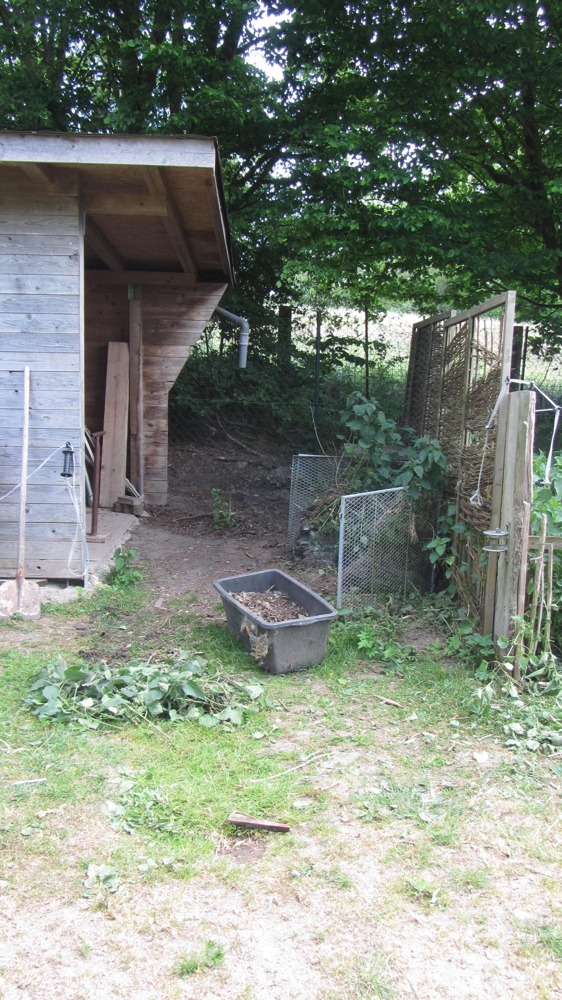

# Hühnerstall

Nachdem wir festgestellt haben, dass es hier auf dem Hof viele Ecken gibt,
die etwas Zuwendung benötigen, haben wir uns dazu entschlossen, hinten
am Hühnerstall anzufangen. Hierfür mussten wir keine Materialien kaufen,
da wir noch allerhand zu Hause hatten.

## Ausgangssituation

Wie man auf dem Bild sehen kann, war es eine kleine Gruschelecke.
Diese galt es, auf Vordermann zu bringen. Für die Wasserversorgung
wollten wir den IBC-Tank wieder aufstellen. Dieser stand aber zu dicht
am Stall und war deswegen aus der Ecke geflogen.
Nun sollte er wieder einziehen.

## Fortschritte

Wir hatten während der Arbeiten eine Kamera auf einem Stativ
stehen und haben hin und wieder ein Foto gemacht.
Dank Google Fotos kann man aus Bilderserien gut solche kleinen
GIFs erstellen. Hier kann man im Schnelldurchlauf sehen, wie sich
die Ecke gewandelt hat.

Als Erstes haben wir den Bereich ausgeräumt, damit wir etwas
Platz hatten, um uns bewegen zu können.

Anschließend haben wir das abfallende Gelände etwas ausgeglichen.
Danach konnten wir mit dem Wiederaufbau starten.
Als Erstes kam eine kleine Bütte, die mit Blumen bestückt wurde.
Danach das "Fundament" für den IBC-Tank, und zu guter Letzt wurde
der Kompost wieder aufgestellt.

## Das Ergebnis

Soweit sind wir damit fertig. Das Einzige, was noch fehlt,
ist die Verlängerung der Regenrinne, damit wir das Wasser
auch im IBC-Tank auffangen können.
Der IBC bekommt noch einen Adapter auf Gardena und einen kleinen
Schlauch, damit das Wasser gezielt in die Gießkanne läuft.
Damit können wir dann die Blumen, Hühner und Schweine bewässern.

# Nachtrag

Wir haben noch ein kleines Tor angefertigt, das zwischen Hühnerstall
und Kompost den Durchgang versperrt, damit die Ziegen nicht die neuen
Blumen fressen können.

# Kaffee

Über einen
[Kaffee](https://www.buymeacoffee.com/snuppedelua)
würde ich mich auf jeden Fall freuen.
