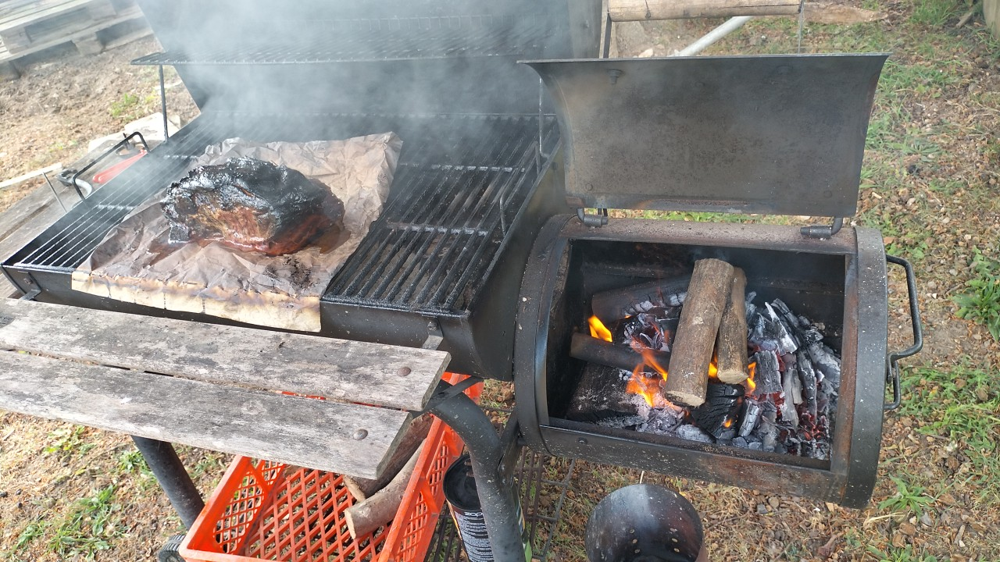
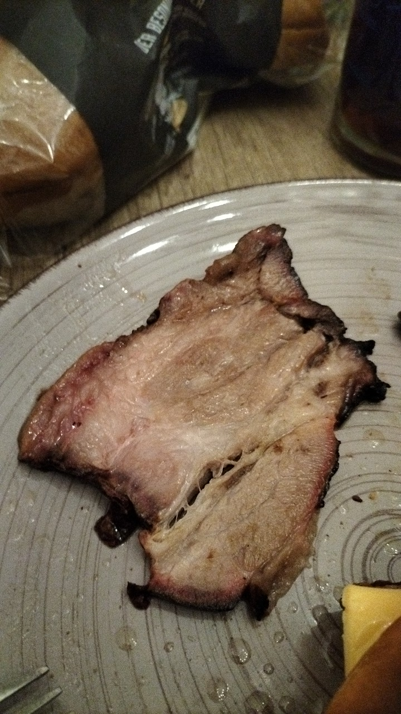

# Smoker

Meine Frau hat vor ein paar Wochen einen günstigen Smoker bei
[Kleinanzeigen](https://kleinanzeigen.de)
gefunden.

Nachdem wir das gute Stück abgeholt hatten, haben wir das
Grillrost erst mal mit einem großen Feuer freigebrannt
und die Gelegenheit gleich zum Grillen genutzt.

Am Freitag war es dann soweit. Wir haben unsere Tiefkühltruhe
durchgesehen und überlegt, was wir am Wochenende so
essen könnten.
Dabei kam die Idee eines klassischen Sonntagsbratens auf.
Diese Idee wurde aber schnell zu BBQ abgewandelt.

# Vorbereitung

Das Fleisch konnte über Nacht auftauen. Am Samstag hat meine Frau
das Fleisch dann in eine Marinade eingelegt.
Diese enthielt diverse Gewürze in rauen Mengen, Honig, Senf und
noch so einiges mehr.

# Die Feuerwehr kann kommen

Am Sonntag war es dann endlich soweit.
Da wir erst recht spät aufgestanden sind und gefrühstückt haben,
kam das Feuer erst um 11 Uhr in Gange.
Dazu habe ich mich kurzerhand einfach an unserem Holzstapel bedient.
Ich habe keine genauere Auswahl hinsichtlich Holzart oder Trocknungszustand getroffen.
Was mir in die Hände fiel, kam auch in das Körbchen.
Mit der Ausbeute ging ich dann zum Grill.
Die Kohle war schnell entfacht.
Dank YouTube hatte ich auch eine grobe Vorstellung, wie ich das Ganze
„richtig“ starten kann.

Als Erstes wurde die Kohle im Kohlekamin vorbereitet.
Anschließend habe ich in der Brennkammer links und rechts je einen dicken
Holzscheit hingelegt. Zwischen die beiden Scheite kam nun die Kohle.
Diese sollte für ausreichende Wärme im Garraum sorgen.
Quer über die beiden Holzscheite kam nun das Holz, das durch die Kohle
Feuer gefangen hatte und anfing, ordentlich zu rauchen.

Das Fleisch kam auf ein Backpapier in den Garraum und alle Deckel wurden
verschlossen ...



Als wir dann sahen, wie der Rauch aus jeder Ritze entquoll und emporstieg,
hatten wir schon kurz Bedenken, dass die Nachbarn eventuell die Feuerwehr
alarmieren könnten. Glücklicherweise blieb dies aber aus.

Somit konnte das Fleisch von 11 Uhr bis ca. 18:30 Uhr vor sich hin räuchern.
Die Temperatur im Garraum schwankte zwischen 90 °C und 130 °C. Überwiegend war
die Temperatur aber an der oberen Grenze.

```
Ich hatte versucht hier ein Video einzufügen.
Leider bin ich mit Hugo an dem Punkt noch etwas auf Kriegsfuß.
Ich arbeite aber noch daran.
```

Alles in allem waren wir für den ersten Versuch sehr zufrieden mit dem
Ergebnis.
Es hat uns sehr gut geschmeckt und das Fleisch war super zart.



# Kaffee

Über einen
[Kaffee](https://www.buymeacoffee.com/snuppedelua)
würde ich mich auf jeden Fall freuen.
