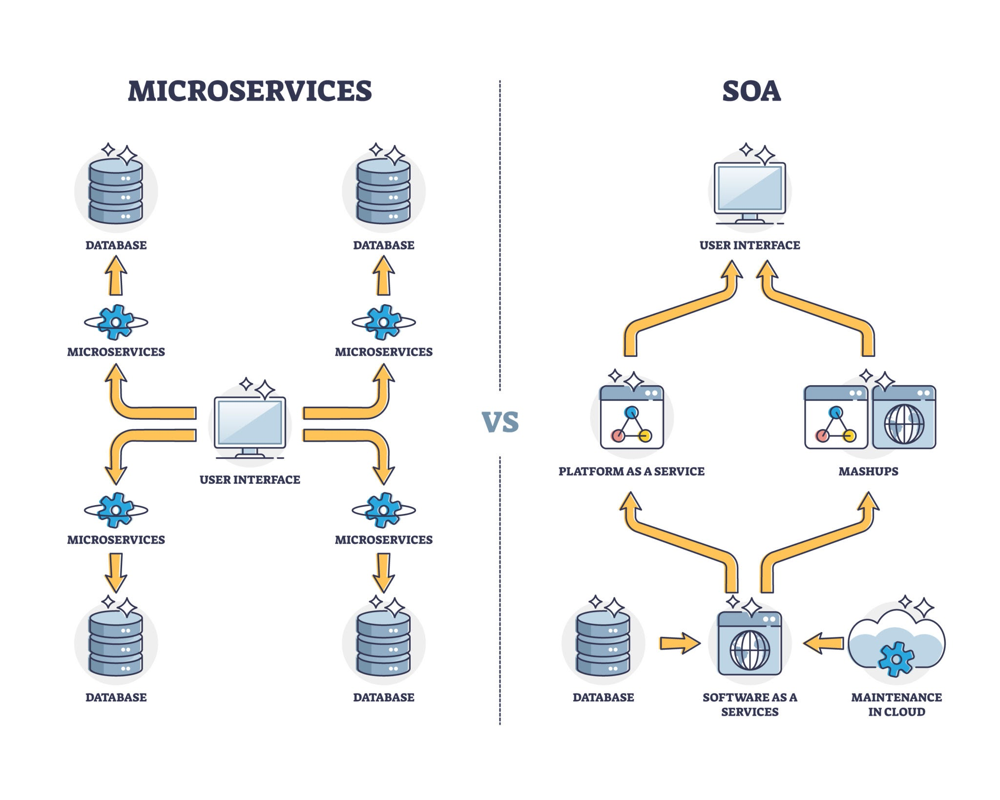

# Trader AI: Ein technischer Einblick in ein KI-gestütztes Handelssystem

In diesem Artikel werfen wir einen detaillierten Blick auf das "Trader AI"-Projekt. Es handelt sich um eine Anwendung, die maschinelles Lernen, genauer gesagt einen K-Nächste-Nachbarn-Algorithmus (KNN), verwendet, um auf Basis historischer Kursdaten Kauf- und Verkaufsentscheidungen für Aktien zu simulieren. Wir beleuchten die Systemarchitektur, die asynchrone Kommunikation im Backend, den Aufbau und das Training des KI-Modells sowie die Funktionsweise des Frontends.

## 1. Systemarchitektur: Ein Überblick

Das Projekt basiert auf einer modernen Microservice-Architektur, die mit docker-compose orchestriert wird. Dieser Ansatz trennt die einzelnen Anwendungsbereiche sauber voneinander, was die Entwicklung, Skalierung und Wartung vereinfacht.

Die Hauptkomponenten sind:

- **Frontend**: Eine mit Vue.js erstellte Single-Page-Application (SPA), die als Benutzeroberfläche dient.
- **Backend**: Eine FastAPI-Anwendung (Python), die als zentrale API-Schnittstelle fungiert.
- **Datenbank**: Eine PostgreSQL-Datenbank zur Speicherung von Trainingsdaten und Simulationsergebnissen.
- **Message Broker**: Redis wird als Nachrichtenwarteschlange verwendet, um langlaufende Aufgaben asynchron zu verarbeiten.
- **Worker**: Dedizierte Python-Prozesse (trainer und trader), die auf Aufgaben aus der Redis-Warteschlange lauschen und diese ausführen (z. B. das Training des Modells oder die Handelssimulation).

Die Kommunikation läuft wie folgt ab: Der Benutzer interagiert mit dem Vue.js-Frontend. Das Frontend sendet Anfragen an das FastAPI-Backend. Das Backend nimmt diese Anfragen entgegen und leitet rechenintensive Aufgaben an die Worker weiter, indem es Jobs in die Redis-Warteschlange stellt. Die Worker verarbeiten diese Jobs und speichern die Ergebnisse in der PostgreSQL-Datenbank. Das Frontend kann dann die Ergebnisse aus der Datenbank abrufen und visualisieren.

## 2. Das Backend: Asynchrone Kommunikation als Schlüssel

Das Herzstück der Anwendung ist das Python-Backend, das auf dem leistungsstarken FastAPI-Framework aufbaut. Ein zentrales Merkmal ist die asynchrone Verarbeitung von Aufgaben, die mithilfe von Redis Queue (RQ) realisiert wird.

### Warum asynchron?

Das Trainieren eines KI-Modells oder das Durchführen einer Handelssimulation über einen langen Zeitraum kann mehrere Minuten dauern. Würde das Backend diese Anfragen synchron (also blockierend) bearbeiten, müsste der Benutzer im Frontend die ganze Zeit auf eine Antwort warten. Die Anwendung wäre nicht reaktionsfähig.

### Der Ablauf im Detail (main.py, knn_worker.py, trainer.py)

1. **Anfrage empfangen**: Das Frontend sendet eine Anfrage, z. B. zum Starten des Trainings für die "Apple"-Aktie, an einen Endpunkt in main.py (z. B. /train).
2. **Job erstellen**: Anstatt den Trainingsprozess direkt zu starten, erstellt das Backend einen Job und stellt ihn in eine Redis-Warteschlange. Dieser Job enthält alle notwendigen Informationen, wie das Aktiensymbol und den Zeitraum. Das Backend antwortet dem Frontend sofort mit einer Job-ID, was die Benutzeroberfläche reaktionsfähig hält.
3. **Job verarbeiten**: Ein separater Worker-Prozess (trainer.py), der im Hintergrund läuft, überwacht die Redis-Warteschlange. Sobald ein neuer Job eintrifft, nimmt der Worker ihn auf und beginnt mit der Verarbeitung – in diesem Fall dem Training des KNN-Modells.
4. **Ergebnisse speichern**: Nach Abschluss des Trainings speichert der Worker das trainierte Modell als Datei (.pkl) und die Ergebnisse in der PostgreSQL-Datenbank.

Derselbe Mechanismus wird für die Handelssimulation (/trade) verwendet, die vom trader.py-Worker ausgeführt wird. Dieser asynchrone Ansatz macht die Anwendung robust und skalierbar.

## 3. Das KNN-Modell: Aufbau und Training

Das Kernstück der KI ist ein K-Nächste-Nachbarn-Klassifikator aus der scikit-learn-Bibliothek. Dieses Modell trifft Vorhersagen auf Basis der Ähnlichkeit neuer Datenpunkte zu bereits bekannten, klassifizierten Datenpunkten.

### Schritt 1: Datenerfassung (data_fetcher.py)

Zunächst werden historische Aktiendaten benötigt. Der data_fetcher.py nutzt die yfinance-Bibliothek, um OHLC-Daten (Open, High, Low, Close) sowie das Handelsvolumen von Yahoo Finance abzurufen.

### Schritt 2: Feature Engineering und Labeling (trainer.py)

Reine Kursdaten sind für ein KI-Modell oft nicht aussagekräftig genug. Daher werden zusätzliche Merkmale (Features) berechnet, um dem Modell mehr Kontext zu geben. Dazu gehören gängige technische Indikatoren wie:

- **Simple Moving Averages (SMA)**: Gleitende Durchschnitte über verschiedene Zeiträume (z. B. 15 und 50 Tage).
- **Relative Strength Index (RSI)**: Ein Momentum-Indikator, der die Geschwindigkeit und Richtung von Kursbewegungen misst.

Anschließend werden die Daten gelabelt, d. h. jedem Zeitpunkt wird eine gewünschte Aktion zugeordnet:

- **1 (Kaufen)**: Wenn der Kurs in der nahen Zukunft signifikant steigt.
- **-1 (Verkaufen)**: Wenn der Kurs in der nahen Zukunft signifikant fällt.
- **0 (Halten)**: In allen anderen Fällen.

### Schritt 3: Das Training (trainer.py)

Die aufbereiteten Daten (Features und Labels) werden in Trainings- und Testsets aufgeteilt. Der KNeighborsClassifier wird dann mit dem Trainingsset trainiert. Das Modell "lernt" dabei, Muster in den technischen Indikatoren mit zukünftigen Kursbewegungen zu verknüpfen. Das trainierte Modell wird anschließend als .pkl-Datei gespeichert, um es später für Vorhersagen im trader-Modul zu verwenden.

## 4. Die Anwendung: Frontend und Benutzung

Das Frontend wurde mit Vue.js entwickelt und bietet eine intuitive Oberfläche zur Steuerung der Simulation.

So wird die Anwendung bedient (HomeView.vue):

1. **Aktie auswählen**: Der Benutzer wählt aus einer Dropdown-Liste ein Aktiensymbol aus (z. B. AAPL für Apple).
2. **Zeitraum festlegen**: Er gibt ein Start- und Enddatum für die Simulation an.
3. **Startkapital definieren**: Der Benutzer legt fest, mit wie viel Kapital die Simulation beginnen soll.
4. **Training starten**: Ein Klick auf "Training starten" stößt den oben beschriebenen asynchronen Trainingsprozess für die ausgewählte Aktie und den Zeitraum an.
5. **Trading starten**: Nach Abschluss des Trainings kann der Benutzer auf "Trading starten" klicken. Dies startet die Handelssimulation. Der trader-Worker lädt das trainierte Modell, geht die historischen Daten Tag für Tag durch, trifft Vorhersagen und simuliert Käufe und Verkäufe.
6. **Ergebnisse visualisieren**: Die Ergebnisse werden in einem interaktiven Diagramm (LineChart.vue) dargestellt. Es zeigt zwei Linien:

- Den tatsächlichen Schlusskurs der Aktie.
- Den Wert des simulierten Portfolios über die Zeit.

So kann der Benutzer auf einen Blick erkennen, wie gut die Strategie des KI-Modells im Vergleich zu einer einfachen "Buy and Hold"-Strategie abgeschnitten hätte.

## 5. Offene Punkte und Ausblick (todo.md)

Das Projekt ist eine solide Grundlage, aber es gibt noch viele Ideen für die Zukunft. Ein Blick in die todo.md verrät die nächsten geplanten Schritte:

- **Modellverbesserungen**:
  - Implementierung eines Test-Train-Splits, um die Modellgüte besser bewerten zu können.
  - Optimierung der Hyperparameter des KNN-Modells (z. B. die Anzahl der Nachbarn k).
  - Hinzufügen weiterer technischer Indikatoren als Features.
- Architektur und Code-Qualität:
  - Refactoring des Codes, um Duplikate zu reduzieren (z. B. in knn_worker.py und trainer.py).
  - Verbesserung der Fehlerbehandlung und des Loggings.
- Frontend-Erweiterungen:
  - Anzeige des Modell-Scores (Genauigkeit) im Frontend.
  - Hinzufügen von Ladeindikatoren, um dem Benutzer besseres Feedback zu geben.
  - Visualisierung der einzelnen Kauf- und Verkaufspunkte im Chart.

Diese Punkte zeigen, dass das Projekt lebendig ist und kontinuierlich weiterentwickelt wird, um die Vorhersagequalität und die Benutzererfahrung zu verbessern.

Ich hoffe, dieser Artikel gibt dir einen guten und detaillierten Überblick über dein Projekt! Du kannst ihn direkt als Basis für deine Dokumentation oder einen Blog-Beitrag verwenden. Lass es mich wissen, wenn du Anpassungen oder weitere Details wünschst!

# Link zum Projekt

Das Projekt ist für einen Test unter
[projekt.beckmann-md.de](https://projekt.beckmann-md.de)
online. Die Seite wird sind in den nächsten Tagen und Wochen
noch etwas anpassen.

# Kaffee

Über einen
[Kaffee](https://www.buymeacoffee.com/snuppedelua)
würde ich mich auf jeden Fall freuen.
